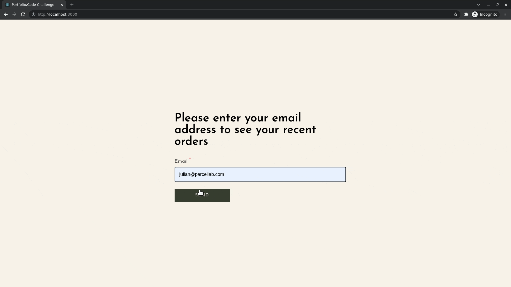

# Getting started

Clone this repo (note the `recurse-submodules` option):

```
git clone --recurse-submodules git@github.com:federico-arias/pl.git
```

To execute the backend, run from the root of the repository:

```
cd backend && yarn && yarn start
```

To execute the frontend, run from the root of the repository:

```
cd frontend && yarn && yarn start
```

Go to [http://localhost:3000][dev] on your browser.

[dev]: http://localhost:3000

# API Documentation

The Swagger Documentation can be found in [http://localhost:1313/docs][docs].

[docs]: http://localhost:1313/docs

# Screenshots

You should be seeing something similar to this when you open the app.


